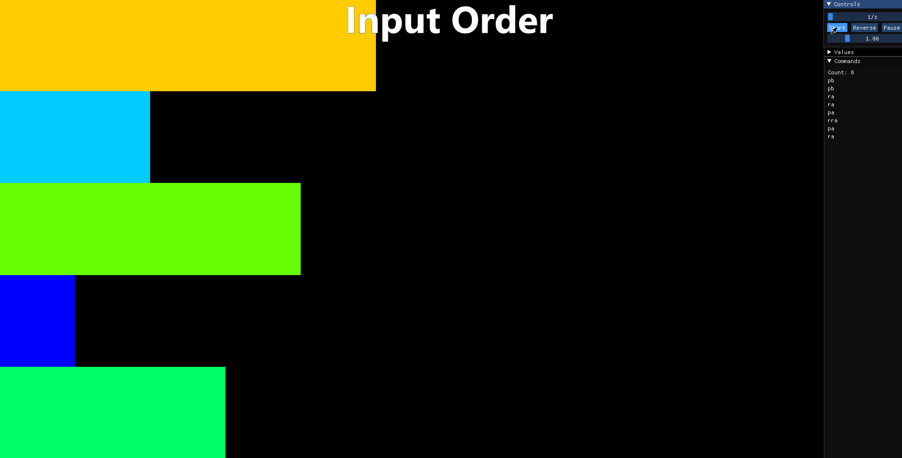

# Push_swap

[](https://en.wikipedia.org/wiki/C_(programming_language))
[](https://www.gnu.org/software/make/)

This project is part of the curriculum at [42 school](https://42.fr/), designed to deepen understanding of sorting algorithms, data structures, and low-level operations by implementing a sorting program with specific constraints.

## Project Goal

The objective is to sort a given list of unique integers using a limited set of operations and only two stacks, conventionally named `A` and `B`. The initial list resides entirely in stack `A`, and stack `B` starts empty. The goal is to have stack `A` contain all integers sorted in ascending order (smallest at the top) and stack `B` to be empty at the end.

**Efficiency Criterion:** The *only* measure of efficiency for this project is the **total number of operations** performed. The lower the number of operations, the better the solution. The evaluation typically focuses on the *maximum* number of operations required for worst-case inputs of a given size, rather than the average.

## Available Operations

The sorting algorithm must be implemented using only the following operations:

*   `sa` (swap a): Swap the first 2 elements at the top of stack A. Do nothing if there is only one or no elements.
*   `sb` (swap b): Swap the first 2 elements at the top of stack B. Do nothing if there is only one or no elements.
*   `ss`: `sa` and `sb` at the same time.
*   `pa` (push a): Take the first element at the top of B and put it at the top of A. Do nothing if B is empty.
*   `pb` (push b): Take the first element at the top of A and put it at the top of B. Do nothing if A is empty.
*   `ra` (rotate a): Shift up all elements of stack A by 1. The first element becomes the last one.
*   `rb` (rotate b): Shift up all elements of stack B by 1. The first element becomes the last one.
*   `rr`: `ra` and `rb` at the same time.
*   `rra` (reverse rotate a): Shift down all elements of stack A by 1. The last element becomes the first one.
*   `rrb` (reverse rotate b): Shift down all elements of stack B by 1. The last element becomes the first one.
*   `rrr`: `rra` and `rrb` at the same time.

## Demo



```
# Example: Sorting 5 2 4 1 3 (shown visually above)
./push_swap 5 2 4 1 3
pb
pb
ra
ra
pa
rra
pa
ra
```

## Usage

1.  **Clone the repository:**
    ```bash
    git clone https://github.com/alimnaqvi/push_swap
    cd push_swap
    ```

2.  **Compile the program:**
    ```bash
    make
    ```
    This will create the `push_swap` executable. You can also use `make clean`, `make fclean`, and `make re`.

3.  **Run the program:**
    Provide the integers to sort as command-line arguments. They must be unique integers within the `int` range.

    *   **Multiple arguments:**
        ```bash
        ./push_swap 4 67 3 8 45
        ```
    *   **Single string argument (numbers separated by spaces):**
        ```bash
        ./push_swap "4 67 3 8 45"
        ```

    The program will output the sequence of push_swap operations required to sort the list. If the input is invalid (non-integers, duplicates, overflows) or already sorted, it will output "Error" or nothing, respectively.

## Performance Benchmarks

The project had specific performance requirements based on the number of operations for randomly generated lists.

*   **Passing Requirement (at the time):** Sort 100 random numbers in **<= 700** operations (maximum).
*   **Full Score Requirement:** Sort 500 random numbers in **<= 5500** operations (maximum).

**My Implementation's Performance:** This implementation successfully meets the full score requirement.

| # of integers | Max. # of operations (approx.) | Avg. # of operations (approx.) |
| :------------ | :----------------------------- | :----------------------------- |
| 500           | 5480                           | 5165                           |
| 100           | 667                            | 581                            |
| 50            | 263                            | 231                            |
| 20            | 80                             | 68                             |
| 10            | 30                             | 25                             |
| 5             | 11                             | 7                              |
| 3             | 2                              | 1                              |

Here is a visual example for 100 numbers (sorted in 600 operations):


## Algorithm and Implementation Details

The standard sorting algorithms (like Bubble Sort, Quick Sort, Merge Sort) are generally inefficient or impractical under the strict constraints of push_swap (limited operations, two stacks, no direct random access). Therefore, this project implements a custom algorithm tailored to minimize the number of push_swap operations.

1.  **Data Structure:**
    *   Stacks `A` and `B` are implemented using singly linked lists (`t_list` struct defined in `push_swap.h`). This allows efficient push/pop/rotate operations at the head/tail of the list.
    *   A separate linked list (`ops_list`) temporarily stores the sequence of operations performed before optimization and final output.

2.  **Input Parsing and Validation (`parse_args_make_list.c`, `utils_atoi.c`, `utils_split.c`):**
    *   The program accepts integers either as multiple command-line arguments or a single space-separated string.
    *   `ft_split` is used to handle the single string case.
    *   `ft_atoi_error` robustly converts strings to integers, checking for non-digit characters and integer overflow/underflow (`INT_MAX`, `INT_MIN`).
    *   Input validation ensures all arguments are unique integers. Duplicates or invalid inputs result in an "Error" message.
    *   The validated numbers are added to stack `A`.

3.  **Data Simplification (`simplify_data.c`):**
    *   Before sorting, the input numbers are replaced by their ranks (indices from 0 to N-1).
    *   This is done by creating a temporary array of the numbers, sorting it, and then iterating through the linked list (stack A) to replace each number with its index in the sorted array.
    *   This simplification makes the sorting logic independent of the actual magnitude of the input numbers and simplifies comparisons (we now sort numbers from 0 to N-1).

4.  **Core Sorting Logic (`init_sort_and_display_ops.c`, `find_best_move.c`, `perform_rotations.c`):**
    *   **Base Cases:** Handles lists of size 2 (`sa`) and size 3 (`sort_three`) directly with minimal operations.
    *   **General Case (N > 3):**
        *   Push all elements from stack `A` to stack `B`, except for the three largest-ranked elements (`pb`). This leaves A with three elements.
        *   Sort the three elements remaining in stack `A` using `sort_three`.
        *   **Iterative Insertion:** While stack `B` is not empty:
            *   Calculate the **cost** (number of operations) to move each element from `B` to its correct sorted position in `A`.
            *   The cost calculation (`find_best_move`) considers the rotations needed in both `A` (`ra`/`rra`) and `B` (`rb`/`rrb`) to bring the element from `B` and its target slot in `A` to the top of their respective stacks. It intelligently calculates the cheapest direction (up/down) for rotations (`compute_rotts`) and accounts for combined rotations (`rr`/`rrr`).
            *   The `get_target_position_in_a` function determines the optimal position in `A` where the element from `B` should be inserted to maintain the relative sorted order of elements already in `A`.
            *   Select the element in `B` that requires the **minimum total rotations** to move to `A`.
            *   Execute the calculated best rotations (`perform_best_move_rotations`). This function efficiently combines `ra`/`rb` into `rr` and `rra`/`rrb` into `rrr` when both stacks need rotating in the same direction.
            *   Push the chosen element from `B` to `A` (`pa`).
        *   **Final Rotation:** Once `B` is empty, `A` contains all elements in relative sorted order, but potentially rotated. Rotate `A` (`ra` or `rra`) until the smallest element (rank 0) is at the top (`find_min_pos` helps determine the cheapest direction).

5.  **Operation Optimization (`optimize_ops.c`):**
    *   Before printing the operation sequence, two optimization passes are performed on the `ops_list`:
        *   `replace_double_op`: Combines adjacent compatible operations into their combined form (e.g., `ra` followed by `rb` becomes `rr`; `rra` followed by `rrb` becomes `rrr`; `sa` followed by `sb` becomes `ss`).
        *   `remove_neutral_ops`: Removes pairs of operations that cancel each other out (e.g., `pa` followed by `pb`; `ra` followed by `rra`).

6.  **Output (`display_ops` in `utils_sort.c`):**
    *   Prints the final, optimized list of operations, one per line.

## Concepts Learned and Applied

This project provided valuable experience in several areas:

*   **Sorting Algorithms:** In-depth analysis of various algorithms (Bubble, Selection, Insertion, Quick Sort, Radix Sort) and understanding their time/space complexity and suitability (or lack thereof) for the specific push_swap constraints. Development of a custom, constraint-aware sorting strategy.
*   **Data Structures:** Practical application of linked lists for stack implementation and understanding their advantages (dynamic size, efficient insertion/deletion at ends) compared to arrays in this context. Temporary use of arrays for data simplification.
*   **Algorithm Design:** Designing a greedy algorithm (`find_best_move`) to make locally optimal choices (minimum rotation cost) hoping for a globally efficient solution. Cost analysis and optimization techniques.
*   **Low-Level Operations:** Working directly with stack manipulations and understanding the impact of each allowed operation.
*   **Input Parsing and Validation:** Implementing robust parsing (`ft_atoi_error`, `ft_split`) to handle various inputs and edge cases (duplicates, non-numeric values, integer limits).
*   **Memory Management:** Careful use of `malloc` and `free` to manage memory for linked list nodes and temporary data structures (e.g., split strings, sorted array), preventing memory leaks (`free_stack`, `free_splits`).
*   **Modular Programming:** Breaking down the problem into smaller, manageable functions and files (`main.c`, `parse_*.c`, `simplify_data.c`, `utils_*.c`, `*_sort_*.c`, `*_ops.c`) for better organization and maintainability.
*   **Debugging:** Systematically debugging complex logic involving state changes across two stacks and optimizing operation sequences.

## Project Structure

```
.
├── push_swap.h             # Header file with struct definitions and prototypes
├── Makefile                # Build rules for the project
├── main.c                  # Main program entry point, orchestration
├── parse_args_make_list.c  # Input argument parsing and initial list creation
├── simplify_data.c         # Rank indexing of input numbers
├── init_sort_and_display_ops.c # Main sorting logic coordinator
├── find_best_move.c        # Logic to find the cheapest move from B to A
├── perform_rotations.c     # Executes the calculated rotations efficiently
├── optimize_ops.c          # Post-processing optimization of operations
├── push_swap.c             # Implementation of the core push_swap operations (sa, pb, ra, etc.)
├── utils_atoi.c            # Robust string-to-integer conversion
├── utils_split.c           # String splitting utility
├── utils_list.c            # Linked list utility functions
└── utils_sort.c            # Sorting-related utility functions (display, find min/max)
```

## Dependencies

*   A C compiler (e.g., `gcc` or `clang`)
*   `make` for building the project
